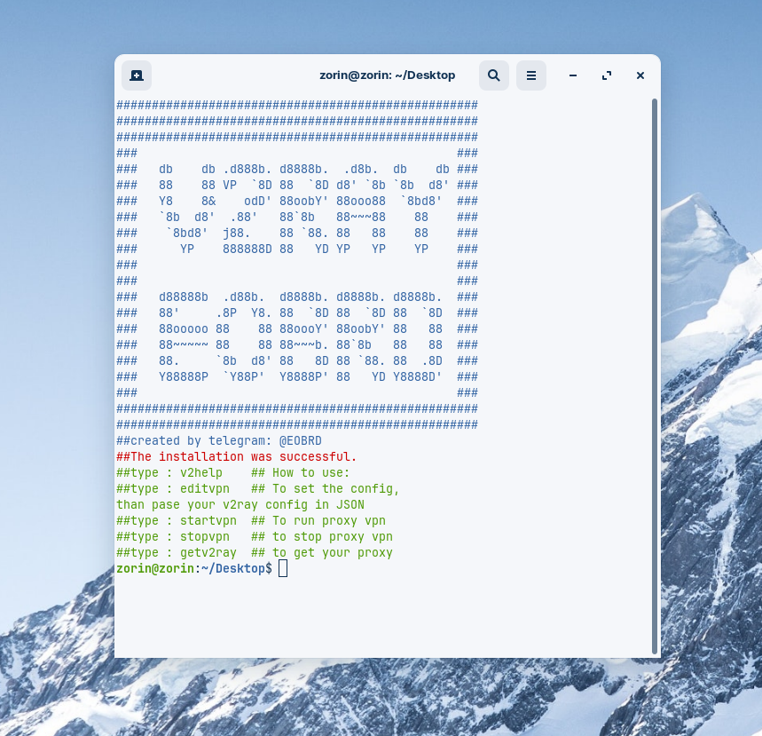
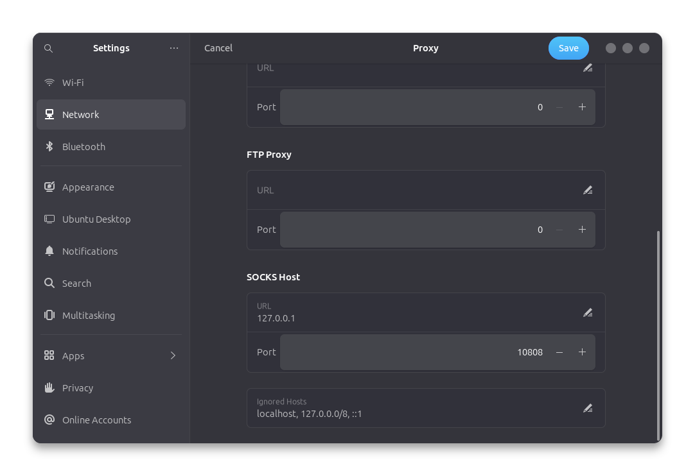

# v2ray for ubuntu,debian,kali,zorin and more....

### What does this script do?
In cases where you have problems working with other v2ray clients, this open source script can be an easy way to use v2ray configurations in Debian-based Linux.

### Prerequisites for installing this script?
$ sudo apt update -y
$ sudo apt install curl unzip nano 

### How to install the script?
$ cd 
$ git clone https://github.com/eobardtawne/v2ray.git
$ cd ./v2ray
$ sudo bash ./install-v2ray.sh

